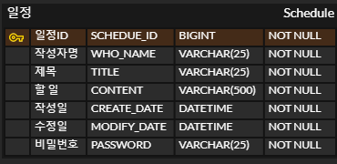

* 읽어주세요.
<br> <br>
깃 허브로 보시면 이상하게 나올 수도 있어요.
인텔리 제이에서 보시는 걸 눈 건강에 추천드립니다. 
---
## ※ API 명세서

```json

1. 일정 전체 조회 

- HTTP Method : GET
- URL : /schedules

|| Request Parameters
- @PathVariable : X
- @RequestParam : X
- @RequestBody : X 

|| Request

localhost:8080/schedules

|| Response
[
  {
     "whoName" : "작성자 이름",
     "title" : "제목",
     "content" : "내용",
     "createDate" : "작성일자",
     "modifiedDate" : "수정일자"
  }
  { 
     "whoName" : "작성자 이름2",
     "title" : "제목2",
     "content" : "내용2",
     "createDate" : "작성일자2",
     "modifiedDate" : "수정일자2"
  }
  ...
]

|| Description
1. 수정일자 기준 내림차순 정렬
```

```json
2. 일정 단일 조회

- HTTP Method : GET
- URL : /schedules/{id}

|| Request Parameters
- @PathVaraible :
  1. id / type : Long / 1 <= id <= 등록된 일정 수
- @RequestParam : X
- @RequestBody : X 

|| Request

localhost:8080/schedules/1

|| Response

{
  "whoName": "김아무개",
  "title": "우당탕탕 서울 여행",
  "content": "지하철역 노숙하기",
  "createDate" : "2000-03-04 16:43:32",
  "modifiedDate": "2000-03-05 12:34:12"
}

|| Bad

"해당 일정의 id 값이 존재하지 않습니다."

|| Desccription
X
```

```json
3. 일정 생성

- HTTP Method : POST
- URL : schedules

|| Request Parameters
- @PathVariable : X 
- @RequestParam : X
- @RequestBody :
{
  "whoName": "이름", - varchar(25)  not null
  "title" : "제목", - varchar(25)  not null
  "content": "내용", - varchar(500) not null
  "password": "비밀번호"   - varchar(25)  null
}

|| Request

localhost:8080/schedules

{
  "whoName" : "김칠청",
  "title": "등산 하기",
  "content": "친구랑 같이 히말라야 정상까지 찍고 올거임",
  "password": "1234abcd"
}

|| Response

{
  "id" : 1,
  "whoName": "김칠청",
  "title": "등산 하기",
  "content": "친구랑 같이 히말라야 정상까지 찍고 올거임",
  "createDate": "2025-03-24 16:22:32",
  "modifiedDate" : "2025-03-24 16:22:32",
  "password": "1234abcd"
}

"일정 생성 성공"

|| Bad

"일정 생성에 실패하셨습니다."

|| Description
X 

```

```json
4. 일정 수정

- HTTP Method : Put
- URL : /schedules/{id}?password=?

|| Request Parameter
- @PathVariable : 
    - id / Long / 1 <= id <= 등록된 일정 수
- @RequestParam :
    - password=? / varchar(25) / 사용자 비밀번호 입력  
- @RequestBody : 
{
  "whoName": "수정된 이름",  - varchar(25)  not null
  "title": "수정된 제목", - varchar(25)  not null
  "content": "수정된 내용"   - varchar(500) not null
}

|| Request

localhost:8080/schedules/1?password=1324123ads

{
  "whoName" : "장칠득",
  "title": "뒷골목 무쌍 찍기",
  "content": "뒷골목의 왕이 되기 위한 일정 ....."
}

|| Response

{
  "whoName": "장칠득",
  "title" : "뒷골목 무쌍 찍기",
  "content": "뒷골목의 왕이 되기 위한 일정 ....."
}

"수정 성공" 

|| Bad

"수정 실패"

|| Description
X

```

```json
5. 일정 삭제

- HTTP Method : DELETE
- URL : /schedules/{id}?password=?

|| Request Parameters
- @PathVariable : 
    - id / Long / 1 <= id <= 등록된 일정 수
- @RequestParam :
    - password=? / varchar(25) / 사용자 비밀번호 입력
- @RequestBody : X 

|| Request

localhost:8080/schedules/1?password=3132341aas

|| Response

"일정이 삭제되었습니다."

|| Bad

"잘못된 요청입니다."

|| Description
X  
```

## ※ ERD 


